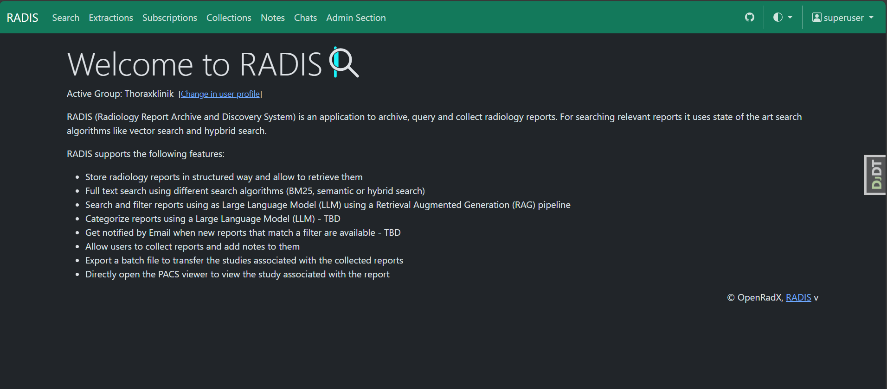
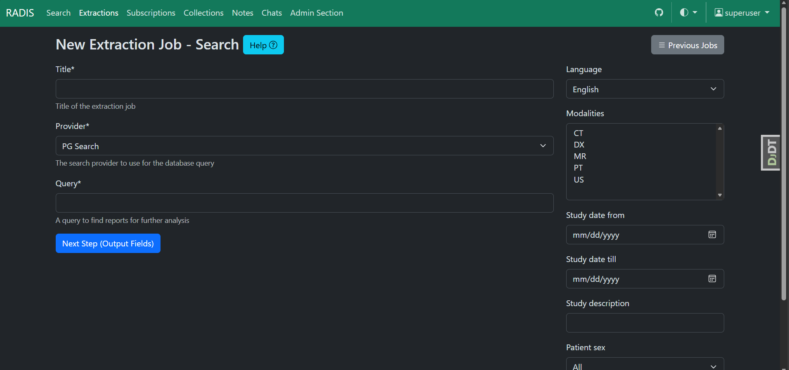

# RADIS

## About

RADIS (Radiology Report Archive and Discovery System) is an innovative open-source web application developed by our team to enhance the management, retrieval, and analysis of radiology reports within hospital infrastructures.

The detailed documentation of RADIS can be found at <https://openradx.github.io/radis/>.

**Developed at**

<table>
  <tr>
    <td align="center"><a href="https://ccibonn.ai/"> CCIBonn.ai</a></td>
  </tr>
</table>

**in Partnership with**

<table>
  <tr>

  </tr>
  <tr>
    <td align="center"><a href="https://www.ukbonn.de/"> Universitätsklinikum Bonn</a></td>
    <td align="center"><a href="https://www.thoraxklinik-heidelberg.de/"> Thoraxklinik Heidelberg</a></td>
  </tr>
  <tr>
    <td align="center"><a href="https://www.klinikum.uni-heidelberg.de/kliniken-institute/kliniken/diagnostische-und-interventionelle-radiologie/klinik-fuer-diagnostische-und-interventionelle-radiologie/"> Universitätsklinikum Heidelberg</a></td>
  </tr>
</table>

> [!IMPORTANT]
> RADIS is currently in an early phase of development. While we are actively building and refining its features, users should anticipate ongoing updates and potential breaking changes as the platform evolves. We appreciate your understanding and welcome feedback to help us shape the future of RADIS.

## Features

- **Intuitive Web Interface**: Simplified access to radiology reports stored in the application database through a user-friendly web portal.
- **Advanced Text Search**: Full-text search with boolean operators and metadata filters, optionally combined with semantic search when an embedding model is configured.
- **Seamless PACS Viewer Integration**: Direct access to PACS viewers with deep linking to relevant studies, leveraging the viewer's capabilities for a smooth workflow.
- **Automated Labeling**: Large language models (LLMs) assign administrator-defined labels to reports, shown as badges and usable as a search filter.
- **Structured Data Extraction**: Extraction jobs pull typed fields (text, numbers, booleans, selections) out of thousands of reports at once, with results exportable as CSV.
- **Smart Notification System**: Subscription service that notifies users of new reports matching specific criteria, with optional LLM-based filter questions and data extraction per report.
- **Report Chat**: Ask an AI assistant questions about an individual report in natural language.
- **Bookmarking and Collection Management**: Organize reports into customizable collections with an intuitive bookmarking service for quick access and review.
- **Custom Report Notes**: Allow users to append personalized notes to reports for additional context or annotations.
- **API and Python Client**: Programmatic access to reports through a REST API and the `radis-client` library.

## Planned

- **Report Quality Assurance**: Tools to review and assess reports for consistency, completeness, and content accuracy, ensuring high-quality documentation.

## API Client

[RADIS Client](https://pypi.org/project/radis-client/) is a Python library for admins to feed reports to RADIS and to retrieve, update or delete them programmatically.

## Architectural overview

RADIS employs a sophisticated multi-container architecture, optimized for local deployment using Docker Swarm mode—a feature included with all Docker installations. This local-first approach ensures compliance with the strict data security requirements inherent in hospital and research environments where sensitive patient or research data is managed. By leveraging Docker Swarm, RADIS offers seamless scalability, allowing services to be easily adjusted to meet the specific computational demands of the deployment site. To simplify the setup process, RADIS provides intuitive deployment scripts, ensuring accessibility for users with varying levels of technical expertise.

The RADIS web service is built on the robust Django Python framework, with data securely stored in a PostgreSQL database. By default, RADIS uses PostgreSQL's built-in full-text search, combined with vector search through the pg_vector extension when an embedding model is configured. Other search systems, such as Vespa or ElasticSearch, can be plugged in through the search provider interface.

To deliver a dynamic and responsive web interface, RADIS integrates modern JavaScript libraries HTMX and Alpine.js. For resource-intensive operations—such as batch evaluations or filtering large datasets—RADIS relies on Procrastinate, a Python-based distributed task processing library. This ensures long-running tasks are executed efficiently in the background, minimizing disruptions to user workflows while maximizing system performance.

RADIS’s design philosophy prioritizes security, flexibility, and user-friendly deployment, making it an ideal solution for managing sensitive data in high-demand environments.

## Screenshots

(Reports are synthetically generated without real patient data)

## Disclaimer

RADIS is intended for research purposes only and is not a certified medical device. It should not be used for clinical diagnostics, treatment, or any medical applications. Use this software at your own risk. The developers and contributors are not liable for any outcomes resulting from its use.

## License

AGPL 3.0 or later
