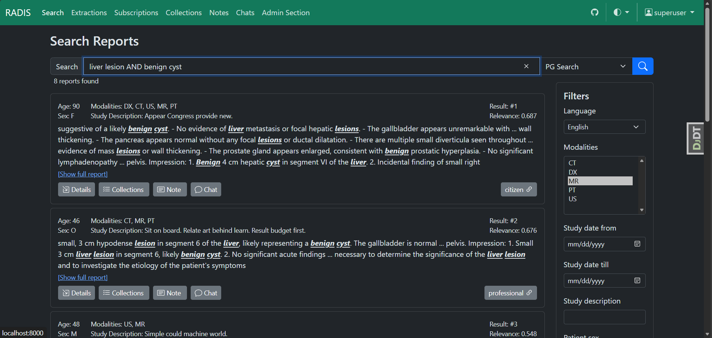

# RADIS

  

    

      
    

    

      
    

    

      
    

    

      
    

  

  <button class="prev" aria-label="Previous slide">❮</button>
  <button class="next" aria-label="Next slide">❯</button>

  

    <button class="dot" role="tab" aria-label="Go to slide 1" data-slide-index="0"></button>
    <button class="dot" role="tab" aria-label="Go to slide 2" data-slide-index="1"></button>
    <button class="dot" role="tab" aria-label="Go to slide 3" data-slide-index="2"></button>
    <button class="dot" role="tab" aria-label="Go to slide 4" data-slide-index="3"></button>
  

  

## Radiology Report Archive and Discovery System

RADIS is an open-source web application designed to enhance the management, retrieval, and analysis of radiology reports within hospital infrastructures.

## Why RADIS?

Healthcare providers need efficient ways to search, organize, and analyze radiology reports. RADIS addresses these challenges with modern search technologies and AI-powered tools.

## What RADIS Does

RADIS serves as a comprehensive platform for managing radiology reports, enabling efficient search, organization, and collaboration.

### How It Works

**RADIS acts as an intelligent hub** for radiology reports:

1. **Report Storage**: Securely store radiology reports with structured metadata
2. **Advanced Search**: Use hybrid search combining traditional text search with semantic understanding
3. **AI-Powered Analysis**: Leverage large language models for intelligent filtering and categorization
4. **Collections**: Organize reports into custom collections for easy access and review
5. **Subscription**: Subscribe to searches and get notified when new matching reports arrive
6. **Notes**: Add personal notes to reports for annotations and context

**Ready to modernize your radiology workflow?** RADIS combines traditional database functionality with cutting-edge AI to make radiology reports more accessible and actionable.

## Developed at

[CCI Bonn](https://ccibonn.ai/) - Center for Computational Imaging, University Hospital Bonn

### in Partnership with

- [Universitätsklinikum Bonn](https://www.ukbonn.de/)
- [Thoraxklinik Heidelberg](https://www.thoraxklinik-heidelberg.de/)
- [Universitätsklinikum Heidelberg](https://www.klinikum.uni-heidelberg.de/kliniken-institute/kliniken/diagnostische-und-interventionelle-radiologie/klinik-fuer-diagnostische-und-interventionelle-radiologie/)

!!! important "Beta Status"
RADIS is currently in an early phase of development. While we are actively building and refining its features, users should anticipate ongoing updates and potential breaking changes as the platform evolves. We appreciate your understanding and welcome feedback to help us shape the future of RADIS.

## Quick Start

1. **Admin Guide**: Learn to configure administrative features in our [Admin Guide](user-docs/admin-guide.md)
2. **User Guide**: Explore features in our [User Guide](user-docs/user-guide.md)
3. **Development**: Explore the architecture overview in our [development guide](dev-docs/architecture.md)

## License

RADIS is licensed under the [AGPL-3.0-or-later](https://github.com/openradx/radis/blob/main/LICENSE) license.
